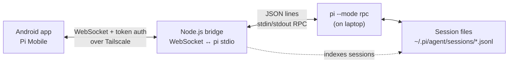

# Pi Mobile

> **Your Pi coding agent, in your pocket.**
> Run and steer coding sessions from Android anywhere over Tailscale.

Pi Mobile is an Android client for the [Pi coding agent](https://github.com/badlogic/pi-mono). It gives you live session control when you’re away from your laptop.

## Demo (WIP)

▶️ **Streamable demo:** https://streamable.com/jngtjp *(WIP)*

## Screenshots

| Chat + tools | Sessions + controls |
|---|---|
|  |  |

## What This Does

Pi runs on your laptop. This app lets you:
- Browse and resume coding sessions from anywhere
- Chat with the agent: prompt, abort, steer, follow-up, compact, rename, copy last response, export, import JSONL sessions
- Discover slash commands from an in-app command palette (`/tree`, `/stats`, `/model`, `/new`, `/name`, `/copy`, `/import`, ...)
- View streaming thinking/tool blocks with collapse/expand controls
- Open a built-in bash dialog (run/abort/history/copy output)
- Inspect session stats, context usage, and pick models from an advanced model picker
- Detect cross-device session drift and run **Sync now** for safe refresh
- Attach images to prompts
- Navigate session tree branches in-place (jump+continue), filter tree views, and fork from selected entries
- Switch between projects (different working directories)
- Handle extension dialogs/widgets/status updates (confirm/input/select/editor/setStatus/setWidget)

The connection goes over Tailscale, so it works anywhere without port forwarding.

## High-Level Design



The bridge is a small Node.js service that translates WebSocket to pi's stdin/stdout JSON protocol. The app connects to the bridge, not directly to pi. For deeper diagrams, see [docs/architecture.md](docs/architecture.md).

## Documentation

- [Documentation index](docs/README.md)
- [Architecture diagrams (Mermaid)](docs/architecture.md)
- [Architecture Decision Records (ADRs)](docs/adr/README.md)
- [Codebase guide](docs/codebase.md)
- [Custom extensions](docs/extensions.md)
- [Bridge protocol reference](docs/bridge-protocol.md)
- [Testing guide](docs/testing.md)

> Note: `docs/ai/` contains planning/progress artifacts used during development. User-facing and maintenance docs live in the top-level `docs/` files above.

## Setup

### 1. Laptop Setup

Install pi if you haven't:
```bash
npm install -g @mariozechner/pi-coding-agent
```

Clone and start the bridge:
```bash
git clone https://github.com/yourusername/pi-mobile.git
cd pi-mobile/bridge
pnpm install
cp .env.example .env
# edit .env and set BRIDGE_AUTH_TOKEN (see Configuration section below)
pnpm start
```

The bridge binds to `127.0.0.1:8787` by default. Set `BRIDGE_HOST` to your laptop Tailscale IP to allow phone access (avoid `0.0.0.0` unless you enforce firewall restrictions). It spawns pi processes on demand per working directory.

For a boot-persistent service with restart policy and Tailscale host auto-detection, see [docs/systemd.md](docs/systemd.md).

### 2. Phone Setup

Install the APK or build from source:
```bash
./gradlew :app:assembleDebug
adb install app/build/outputs/apk/debug/app-debug.apk
```

### 3. Connect

1. Add a host in the app:
   - Host: your laptop's Tailscale MagicDNS hostname (`<device>.<tailnet>.ts.net`)
   - Port: `8787` (or whatever the bridge uses)
   - Use TLS: off for local/Tailscale bridge unless you've put TLS in front
   - Token: set this in `bridge/.env` as `BRIDGE_AUTH_TOKEN`

2. The app will fetch your sessions from `~/.pi/agent/sessions/` (or `BRIDGE_SESSION_DIR` if overridden)

3. Tap a session to resume it

## How It Works

### Sessions

Sessions are grouped by working directory (cwd). Each session is a JSONL file in `~/.pi/agent/sessions/--path--/`. The bridge reads these files directly since pi's RPC doesn't have a list-sessions command.

### Process Management

The bridge manages one pi process per cwd:
- First connection to a project spawns pi (with internal extensions for tree navigation + mobile workflow commands)
- Process stays alive with idle timeout (`BRIDGE_PROCESS_IDLE_TTL_MS`)
- Short disconnects keep control locks during reconnect grace (`BRIDGE_RECONNECT_GRACE_MS`)
- Reconnecting reuses the existing process
- Crash restart with exponential backoff

### Message Flow

```
User types prompt
    ↓
App sends WebSocket → Bridge
    ↓
Bridge writes to pi stdin (JSON line)
    ↓
pi processes, writes events to stdout
    ↓
Bridge forwards events → App
    ↓
App renders streaming text/tools
```

## Chat UX Highlights

- **Thinking blocks**: streaming reasoning appears separately and can be collapsed/expanded.
- **Tool cards**: tool args/output are grouped with icons and expandable output.
- **Edit diff viewer**: `edit` tool calls show before/after content.
- **Command palette**: insert slash commands quickly from the prompt field menu, including bridge-backed mobile commands.
- **Quick copy action**: copy the last assistant response from the chat header menu without typing `/copy`.
- **Bash dialog**: execute shell commands with timeout/truncation handling and history.
- **Session status in chat**: shows the active session name and queued message count from pi state.
- **Session names in session browser**: active named sessions are surfaced more clearly in the Sessions header, rename dialog, and cards.
- **Session stats sheet**: token/cost/message/context counters, queued-message summary, and session path.
- **Model picker**: provider-aware searchable model selection.
- **Tree navigator**: inspect branch points, filter views, jump in-place, or fork from chosen entries.
- **Session coherency guard**: warns on cross-device edits and offers **Sync now**.
- **Settings controls**: auto-compaction, auto-retry, steer/follow-up delivery modes, theme, and status-strip visibility.

## Troubleshooting

### Can't connect

1. Check Tailscale is running on both devices
2. Verify the bridge is running: `curl http://100.x.x.x:8787/health` (only if `BRIDGE_ENABLE_HEALTH_ENDPOINT=true`)
3. Check the token matches exactly (BRIDGE_AUTH_TOKEN)
4. Prefer the laptop's MagicDNS hostname (`*.ts.net`) over raw IP literals

### Sessions don't appear

1. Check `~/.pi/agent/sessions/` exists on laptop
2. Verify the bridge has read permissions
3. Check bridge logs for errors

### Streaming is slow/choppy

1. Check logcat for `PerfMetrics` - see actual timing numbers
2. Look for `FrameMetrics` jank warnings
3. Verify WiFi/cellular connection is stable
4. Try closer to the laptop (same room)

### App crashes on resume

1. Check logcat for out-of-memory errors
2. Large session histories can cause issues
3. Try compacting the session first: `/compact` in pi, then resume

## Development

### Project Structure

```
app/              - Android app (Compose UI, ViewModels)
core-rpc/         - RPC protocol models and parsing
core-net/         - WebSocket transport and connection management
core-sessions/    - Session caching and repository
bridge/           - Node.js bridge service
benchmark/        - Macrobenchmark / baseline profile scaffolding
```

### Running Tests

Use JDK 21 for Android and Gradle work in this repo.

```bash
# Android tests
./gradlew test

# Bridge tests
cd bridge && pnpm test

# Bridge full checks (lint + typecheck + tests)
cd bridge && pnpm run check

# All Android quality checks
./gradlew ktlintCheck detekt test
```

### Logs to Watch

```bash
# Performance metrics
adb logcat | grep "PerfMetrics"

# Frame jank during streaming
adb logcat | grep "FrameMetrics"

# General app logs
adb logcat | grep "PiMobile"

# Bridge logs (on laptop)
pnpm start 2>&1 | tee bridge.log
```

## Configuration

### Bridge Environment Variables

Create `bridge/.env` (or start from `bridge/.env.example`):

```env
# BRIDGE_HOST=100.x.y.z             # Bind host (default: 127.0.0.1)
BRIDGE_PORT=8787                    # Port to listen on
BRIDGE_AUTH_TOKEN=your-secret       # Required authentication token
BRIDGE_PROCESS_IDLE_TTL_MS=300000   # Idle process eviction window (ms)
BRIDGE_RECONNECT_GRACE_MS=30000     # Keep control locks after disconnect (ms)
BRIDGE_SESSION_DIR=/absolute/path/to/.pi/agent/sessions  # Override the session dir used for indexing and spawned pi runtimes
BRIDGE_LOG_LEVEL=info               # fatal,error,warn,info,debug,trace,silent
BRIDGE_ENABLE_HEALTH_ENDPOINT=true  # set false to disable /health endpoint
```

For systemd deployment, use `ops/systemd/pi-mobile-bridge@.service` and `ops/systemd/pi-mobile-bridge.env.example` as the starting point.

### App Build Variants

Debug builds include logging and assertions. Release builds (if you make them) strip these for smaller size.

## Security Notes

- Token auth is required - don't expose the bridge without it
- Token comparison is hardened in the bridge (constant-time hash compare)
- The bridge binds to localhost by default; explicitly set `BRIDGE_HOST` to your Tailscale IP for remote access
- Avoid `0.0.0.0` unless you intentionally expose the service behind strict firewall/Tailscale policy
- `/health` exposure is explicit via `BRIDGE_ENABLE_HEALTH_ENDPOINT` (disable it for least exposure)
- Android cleartext traffic is scoped to `localhost` and Tailnet MagicDNS hosts (`*.ts.net`)
- All traffic goes over Tailscale's encrypted mesh
- Session data stays on the laptop; the app only displays it

## Limitations

- No offline mode - requires live connection to laptop
- Session history is fetched via `get_messages` and rendered in a capped window (no true server-side pagination yet)
- Tree navigation is MVP-level (functional, minimal rendering)
- Mobile keyboard shortcuts vary by device/IME

## Testing

See [docs/testing.md](docs/testing.md) for emulator setup and testing procedures.

Quick start:
```bash
# Start emulator, build, install
./gradlew :app:installDebug

# Watch logs
adb logcat | grep -E "PiMobile|PerfMetrics"
```

## License

MIT
